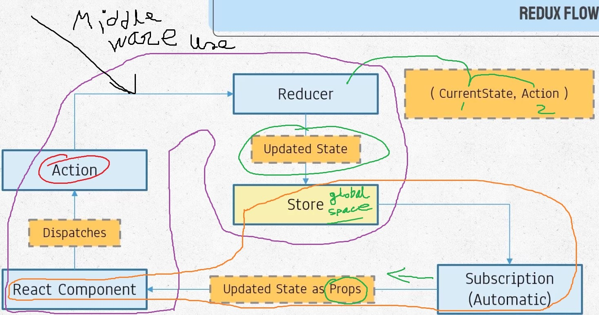
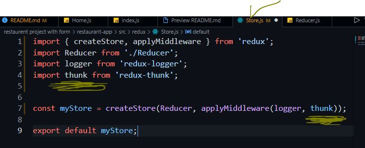

### Redux_react_Middleware


### basic: https://github.com/niamul64/Redux_react/tree/main/basic
### Redux with react app(restaurent project) see: https://github.com/niamul64/Redux_react/tree/main/restaurent%20project%20with%20form

### logger _middleware (monitor all the steps between action dispatch to Reducer)
```
npm install redux-logger --save
```

<br><br><hr>

# Now if we run the server and dispatch an action then:


<br><br><hr>

# use font_awesome: (loding icon)
## font awesome website:
```
npm install font-awesome --save
```
## Now inport the font awesome at index .js file for anbling to whole app.
<br><br><hr>

# Now, we are going to add aspin icon for loading.
## 1. goto body component, add a file 'Loading.js'

<br><br><hr>

# install : redux thunk
```
npm install redux-thunk --save
```
<br><br>

### Now, import thunk to store.js, add to store
<br><br>

### some acction types
<br><br>

# For furthure explanation see the video with this reposetory.